# Issue Definitions Configuration Framework

This repository provides a standalone framework for defining, generating, and applying "Issue Topics" using professional NLP tools. It mirrors the exact logic used in a production analysis pipeline, enabling seamless transition from configuration testing to deployment.

## 🏗️ How it Works

The system follows a professional "Source → Transform → Apply" workflow:

```mermaid
graph LR
    CSV["📄 CSV Definitions<br/>(Excel Friendly)"] -- "generator.py" --> JSON["📦 topics.json<br/>(Structured Config)"]
    JSON -- "example_usage.py" --> Result["🔍 NLP Analysis Result"]
    
    subgraph "The Generation Process"
    CSV
    JSON
    end
    
    subgraph "Production-Grade AI Application"
    Result
    end
```



## 📂 Folder Contents

- **`topic_definitions.csv`**: The primary source. Define your topics, keywords, and anchor terms here.
- **`updated_issue_config_inputs.csv`**: An experimental version including **Exclusionary Terms** for noise reduction.
- **`generator.py`**: Converts CSV to JSON. Includes a toggle to enable/disable exclusionary terms in the output.
- **`example_usage.py`**: A high-fidelity demonstration script. It uses the exact same matching logic as the production pipeline:
    - **spaCy Matcher**: For precise keyword/pattern matching.
    - **SentenceTransformers**: For semantic similarity matching of anchor terms.
    - **Negative Filtering**: For applying exclusionary terms.

## 🚀 Getting Started

### 1. Installation
This framework leverages industrial-strength AI libraries. Install the dependencies:
```bash
pip install -r requirements.txt
```

You also need to download the spaCy English model:
```bash
python -m spacy download en_core_web_sm
```

### 2. Generate your Configuration
Run the generator to transform your CSV definitions into machine-readable JSON:
```bash
python generator.py
```

### 3. Run the Demonstration
Test your configuration using the high-fidelity example script. This script will load the exact models and apply the exact logic used in the main pipeline:
```bash
python example_usage.py
```

## 🛠️ Data Structure & Logic

| Feature | Type | Logic |
| :--- | :--- | :--- |
| **Patterns** | `pattern` | Processed into **spaCy** patterns for 100% accurate keyword matching. |
| **Anchors** | `anchor term` | Converted to **Vector Embeddings** for semantic similarity matching (Default: 0.7 threshold). |
| **Exclusions** | `exclusionary term` | **Negative Filter**: If found in text, the topic label is discarded to reduce noise. |

## 📊 Process Flow


